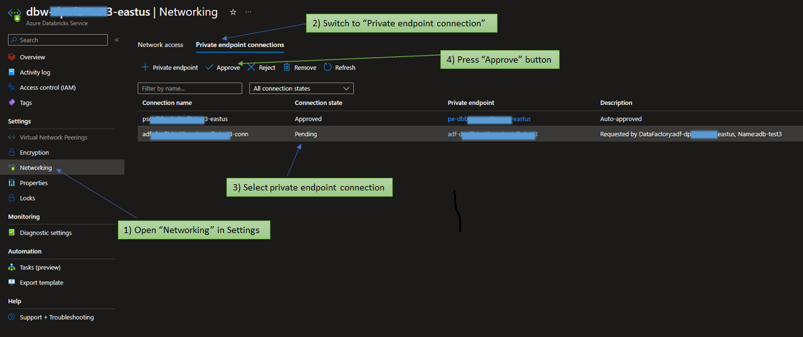

# Azure Data Factory Terraform module
Terraform module for creation Azure Data Factory

## Usage
Current module allow you to create resources for Data Factory and its monitoring. Also it can create [managed private endpoints](https://learn.microsoft.com/en-us/azure/data-factory/managed-virtual-network-private-endpoint#managed-private-endpoints). 
Here we provide some examples of how to provision it with managed_private_endpoint to the Databricks workspace.
Be aware that private endpoint connection is created in a Pending state and an approval workflow is initiated. 
    
To finish this configuration you need to open Azure Databricks Service (or other Azure Service you connect to), chose "Networking" in Settings section. Change to Private endpoint connections tab and select created connection (it should be in a pending state) and press "Approve" button.

```hcl
module "data_factory" {
  source  = "data-platform-hq/data-factory/azurerm"
  version = "1.1.0"

  project                 = "datahq"
  env                     = "example"
  location                = "eastus"
  resource_group          = "example-rg"
  key_vault_name          = "example-key-vault"

  managed_private_endpoint = [{
    name               = "adb"
    target_resource_id = /subscriptions/fgd8a3s8-623d-26c8-b989-f3987042b41s/resourceGroups/example-rg/providers/Microsoft.Databricks/workspaces/dbw-example-resource-id
    subresource_name   = "databricks_ui_api"
  }]

  # Assigns Azure DevOps repo to ADF. Comment it out in case of not using ADO provider.
  # vsts_configuration = 
}
```

<!-- BEGIN_TF_DOCS -->
## Requirements

| Name                                                                      | Version   |
| ------------------------------------------------------------------------- | --------- |
| <a name="requirement_terraform"></a> [terraform](#requirement\_terraform) | >= 1.0.0  |
| <a name="requirement_azurerm"></a> [azurerm](#requirement\_azurerm)       | >= 3.40.0 |

## Providers

| Name                                                          | Version |
| ------------------------------------------------------------- | ------- |
| <a name="provider_azurerm"></a> [azurerm](#provider\_azurerm) | 3.40.0  |

## Modules

No modules.

## Resources

| Name                                                                                                                                                                                  | Type        |
| ------------------------------------------------------------------------------------------------------------------------------------------------------------------------------------- | ----------- |
| [azurerm_data_factory.this](https://registry.terraform.io/providers/hashicorp/azurerm/latest/docs/resources/data_factory)                                                             | resource    |
| [azurerm_data_factory_integration_runtime_azure.auto_resolve](https://registry.terraform.io/providers/hashicorp/azurerm/latest/docs/resources/data_factory_integration_runtime_azure) | resource    |
| [azurerm_data_factory_linked_service_key_vault.this](https://registry.terraform.io/providers/hashicorp/azurerm/latest/docs/resources/data_factory_linked_service_key_vault)           | resource    |
| [azurerm_monitor_diagnostic_setting.this](https://registry.terraform.io/providers/hashicorp/azurerm/latest/docs/data-sources/monitor_diagnostic_categories)                           | resource    |
| [data.azurerm_monitor_diagnostic_categories.this](https://registry.terraform.io/providers/hashicorp/azurerm/latest/docs/resources/monitor_diagnostic_setting)                         | resource    |
| [azurerm_key_vault_access_policy.this](https://registry.terraform.io/providers/hashicorp/azurerm/latest/docs/resources/key_vault_access_policy)                                       | resource    |
| [azurerm_role_assignment.data_factory](https://registry.terraform.io/providers/hashicorp/azurerm/latest/docs/resources/role_assignment)                                               | resource    |
| [azurerm_data_factory_managed_private_endpoint.this](https://registry.terraform.io/providers/hashicorp/azurerm/latest/docs/resources/data_factory_managed_private_endpoint)           | resource    |
| [azurerm_key_vault.this](https://registry.terraform.io/providers/hashicorp/azurerm/latest/docs/data-sources/key_vault)                                                                | data source |

## Inputs

| Name                                                                                                                                  | Description                                                                                                                                 | Type                                                                                              | Default                                                                       | Required |
| ------------------------------------------------------------------------------------------------------------------------------------- | ------------------------------------------------------------------------------------------------------------------------------------------- | ------------------------------------------------------------------------------------------------- | ----------------------------------------------------------------------------- | :------: |
| <a name="input_cleanup_enabled"></a> [cleanup\_enabled](#input\_cleanup\_enabled)                                                     | Cluster will not be recycled and it will be used in next data flow activity run until TTL (time to live) is reached if this is set as false | `bool`                                                                                            | `true`                                                                        |    no    |
| <a name="input_compute_type"></a> [compute\_type](#input\_compute\_type)                                                              | Compute type of the cluster which will execute data flow job: [General\|ComputeOptimized\|MemoryOptimized]                                  | `string`                                                                                          | `"General"`                                                                   |    no    |
| <a name="input_core_count"></a> [core\_count](#input\_core\_count)                                                                    | Core count of the cluster which will execute data flow job: [8\|16\|32\|48\|144\|272]                                                       | `number`                                                                                          | `8`                                                                           |    no    |
| <a name="input_env"></a> [env](#input\_env)                                                                                           | Environment name                                                                                                                            | `string`                                                                                          | n/a                                                                           |   yes    |
| <a name="input_key_vault_name"></a> [key\_vault\_name](#input\_key\_vault\_name)                                                      | Azure Key Vault name to use                                                                                                                 | `string`                                                                                          | `""`                                                                          |    no    |
| <a name="input_key_vault_resource_group"></a> [key\_vault\_resource\_group](#input\_key\_vault\_resource\_group)                      | Azure Key Vault resource group (if differs from from target one)                                                                            | `string`                                                                                          | `""`                                                                          |    no    |
| <a name="input_location"></a> [location](#input\_location)                                                                            | Azure location                                                                                                                              | `string`                                                                                          | n/a                                                                           |   yes    |
| <a name="input_custom_adf_name"></a> [custom\_adf\_name](#input\_custom\_adf\_name)                                                   | Specifies the name of the Data Factory                                                                                                      | `string`                                                                                          | `null`                                                                        |    no    |
| <a name="input_custom_default_ir_name"></a> [custom\_default\_ir\_name](#input\_custom\_default\_ir\_name)                            | Specifies the name of the Managed Integration Runtime                                                                                       | `string`                                                                                          | `null`                                                                        |    no    |
| <a name="input_managed_virtual_network_enabled"></a> [managed\_virtual\_network\_enabled](#input\_managed\_virtual\_network\_enabled) | Is Managed Virtual Network enabled?                                                                                                         | `bool`                                                                                            | `true`                                                                        |    no    |
| <a name="input_permissions"></a> [permissions](#input\_permissions)                                                                   | Data Factory permision map                                                                                                                  | `list(map(string))`                                                                               | <pre>[<br>  {<br>    "object_id": null,<br>    "role": null<br>  }<br>]</pre> |    no    |
| <a name="input_project"></a> [project](#input\_project)                                                                               | Project name                                                                                                                                | `string`                                                                                          | n/a                                                                           |   yes    |
| <a name="input_public_network_enabled"></a> [public\_network\_enabled](#input\_public\_network\_enabled)                              | Is the Data Factory visible to the public network?                                                                                          | `bool`                                                                                            | `false`                                                                       |    no    |
| <a name="input_resource_group"></a> [resource\_group](#input\_resource\_group)                                                        | The name of the resource group in which to create the storage account                                                                       | `string`                                                                                          | n/a                                                                           |   yes    |
| <a name="input_tags"></a> [tags](#input\_tags)                                                                                        | A mapping of tags to assign to the resource                                                                                                 | `map(any)`                                                                                        | `{}`                                                                          |    no    |
| <a name="input_time_to_live_min"></a> [time\_to\_live\_min](#input\_time\_to\_live\_min)                                              | TTL for Integration runtime                                                                                                                 | `string`                                                                                          | `15`                                                                          |    no    |
| <a name="input_virtual_network_enabled"></a> [virtual\_network\_enabled](#input\_virtual\_network\_enabled)                           | Managed Virtual Network for Integration runtime                                                                                             | `bool`                                                                                            | `true`                                                                        |    no    |
| <a name="input_vsts_configuration"></a> [vsts\_configuration](#input\_vsts\_configuration)                                            | Code storage configuration map                                                                                                              | `map(string)`                                                                                     | `{}`                                                                          |    no    |
| <a name="input_log_analytics_workspace"></a> [log\_analytics\_workspace](#input\log\_analytics\_workspace)                            | Log Analytics Workspace Name to ID map                                                                                                      | `map(string)`                                                                                     | `{}`                                                                          |    no    |
| <a name="input_analytics_destination_type"></a> [analytics\_destination\_type](#input\log\_analytics\_destination\_type)              | Log analytics destination type                                                                                                              | `string`                                                                                          | `Dedicated`                                                                   |    no    |
| <a name="input_managed_private_endpoint"></a> [managed\_private\_endpoint](#input\managed\_private\_endpoint)                         | The ID  and sub resource name of the Private Link Enabled Remote Resource which this Data Factory Private Endpoint should be connected to   | <pre> set(object({ <br>   target_resource_id = string <br>   subresource_name   = string <br> })) | `[]`                                                                          |    no    |

## Outputs

| Name                                                                                                                                       | Description                                   |
| ------------------------------------------------------------------------------------------------------------------------------------------ | --------------------------------------------- |
| <a name="output_default_integration_runtime_name"></a> [default\_integration\_runtime\_name](#output\_default\_integration\_runtime\_name) | Data Factory Default Integration Runtime Name |
| <a name="output_id"></a> [id](#output\_id)                                                                                                 | Data Factory ID                               |
| <a name="output_identity"></a> [identity](#output\_identity)                                                                               | Data Factory Managed Identity                 |
| <a name="output_linked_service_key_vault_name"></a> [linked\_service\_key\_vault\_name](#output\_linked\_service\_key\_vault\_name)        | Data Factory Linked Service Key Vault Name    |
| <a name="output_name"></a> [name](#output\_name)                                                                                           | Data Factory Name                             |
<!-- END_TF_DOCS -->

## License

Apache 2 Licensed. For more information please see [LICENSE](https://github.com/data-platform-hq/terraform-azurerm-data-factory/tree/main/LICENSE)
